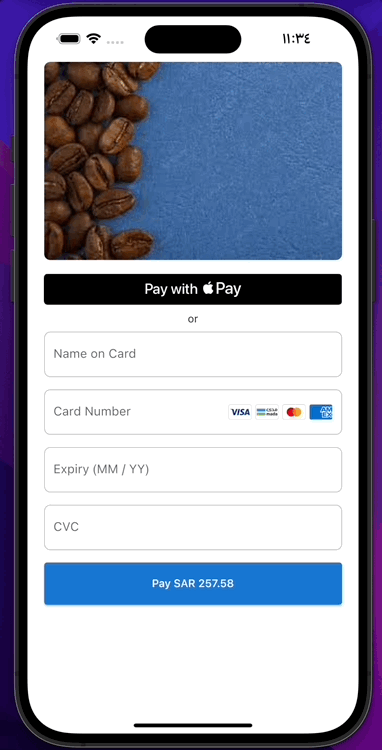

Easily accept payments through Apple Pay or Credit Card (with managed 3DS step) in your Flutter app with Moyasar.



## Features

Use this plugin to support:

- **Apple Pay**: Quickly and safely accept Apple Pay payments.
- **Credit Card**: Easily accept many card companies while not worrying about managing the required 3DS step.

## Getting started

### Prerequisites

#### **Accepting Apple Pay Payments in iOS**

Complete the following steps to easily accept Apple Pay payments:

- Follow [this guide](https://moyasar.com/docs/dashboard/apple-pay/developer-account/) to setup your Apple developer account and integrate it with Moyasar.
- Follow [this guide](https://help.apple.com/xcode/mac/9.3/#/deva43983eb7?sub=dev44ce8ef13) to enable accepting Apple Pay in your application using xCode.
- Create a file named `default_payment_profile_apple_pay.json` under the root of your assets folder. e.g. `assets/default_payment_profile_apple_pay.json`, and don't forget to update the `merchantIdentifier` and `displayName` values.

```json
{
  "provider": "apple_pay",
  "data": {
    "merchantIdentifier": "YOUR_MERCHANT_ID",
    "displayName": "YOUR_SHOP_NAME",
    "merchantCapabilities": ["3DS", "debit", "credit"],
    "supportedNetworks": ["amex", "visa", "mada", "masterCard"],
    "countryCode": "SA",
    "currencyCode": "SAR"
  }
}
```

#### **Accepting Credit Card Payments in Android**

Due to depending on the `flutter_webview` package to manage the 3DS step, make sure to set the correct minSdkVersion in android/app/build.gradle if it was previously lower than 19:

```
android {
    defaultConfig {
        minSdkVersion 19
    }
}
```

### Installation

```sh
flutter pub add moyasar
```

## Usage

```dart
import 'package:flutter/material.dart';
import 'package:moyasar/moyasar.dart';

class PaymentMethods extends StatelessWidget {
  PaymentMethods({super.key});

  final paymentConfig = PaymentConfig(
    publishableApiKey: 'YOUR_API_KEY',
    amount: 25758, // SAR 257.58
    description: 'Blue Coffee Beans',
    metadata: {'size': '250g'},
  );

  void onPaymentResult(result) {
    if (result is PaymentResponse) {
      switch (result.status) {
        case PaymentStatus.paid:
          // handle success.
          break;
        case PaymentStatus.failed:
          // handle failure.
          break;
      }
    }
  }

  @override
  Widget build(BuildContext context) {
    return Column(
      children: [
        ApplePay(
            config: paymentConfig,
            onPaymentResult: onPaymentResult,
        ),
        const Text("or"),
        CreditCard(
          config: paymentConfig,
          onPaymentResult: onPaymentResult,
        )
      ],
    );
  }
}
```
